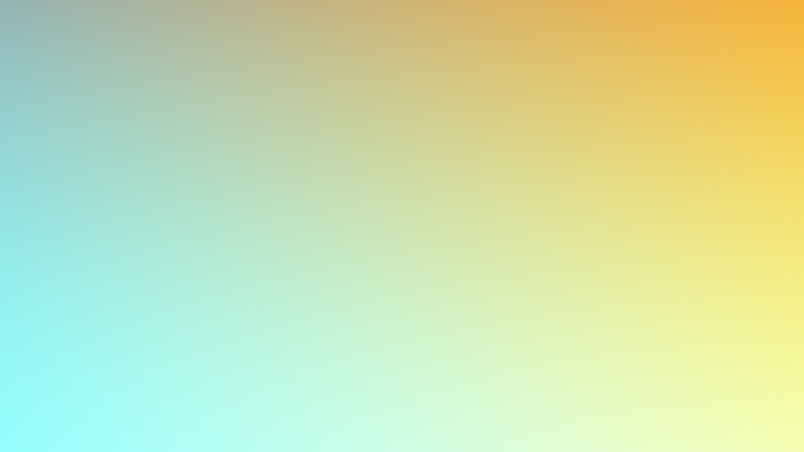

# OpenGL Template

Just a simple OpenGL template that I use on my streams.

## Controls

| Shortcut         | Description                                                                                                                                                               |
|------------------|---------------------------------------------------------------------------------------------------------------------------------------------------------------------------|
| <kbd>q</kbd>    | Quit |
| <kbd>F5</kbd>    | Reload [main.frag](./main.frag) and [main.vert](./main.vert) shaders. Red screen indicates a compilation or linking error, check the output of the program if you see it. |
| <kbd>SPACE</kbd> | Pause/unpause the time uniform variable in shaders                                                                                                                        |
| <kbd>←</kbd><kbd>→</kbd> | In pause mode step back/forth in time. |
